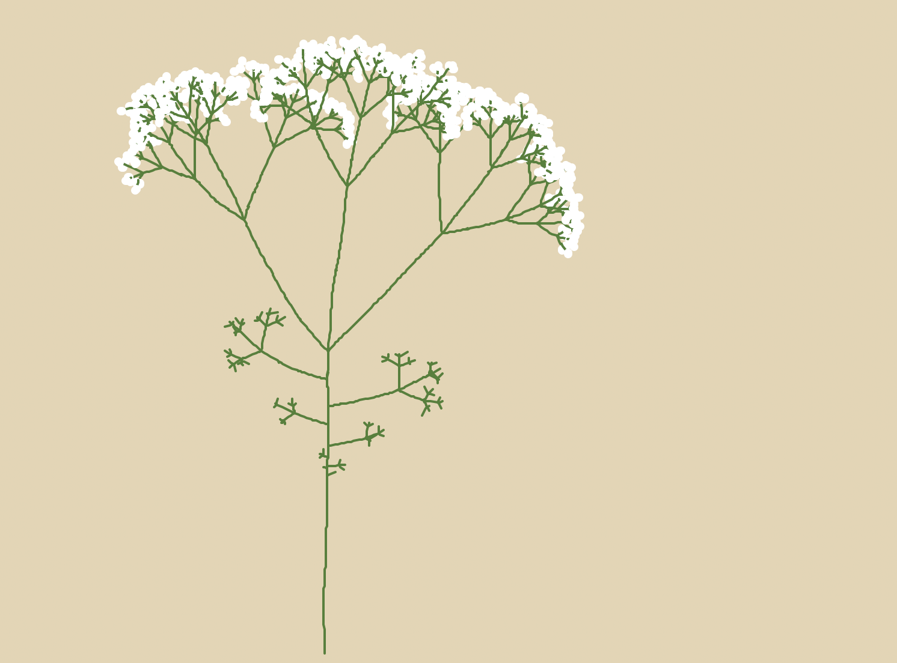

# L-Systems

Hello! This is the code for my (at the time of writing this unreleased)
Computerphile video.

It runs user-defined L-systems using Python's `turtle` module, and also can
simulate graphical effects such as random angles and segment lengths, and
tropism (where the plant points towards the "sun").

## Quickly getting started

If you just want to see pretty pictures, follow these steps:

 1. [Install Python](https://www.python.org/downloads/) if you haven't already.
 2. Download this repository (either via [cloning it](https://docs.github.com/en/repositories/creating-and-managing-repositories/cloning-a-repository) or just [downloading it directly as a ZIP](https://github.com/zac-garby/lsystems/archive/refs/heads/master.zip)).
 3. Run the Python script `lsystem.py`.
    - Through the command line, this is `python3 lsystem.py`.
    - You might be able to just double click the file - I'm not sure.
 4. That's it! I'd recommend full-screening the window, then press ENTER a few
    times to advance the simulation.
    - You can go into "slow mode" by pressing DOWN (and back to fast by pressing
      UP) if you want to show the image as it is being drawn.
